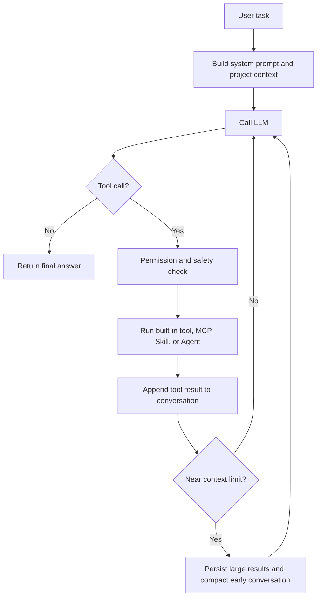

# CodePaceX Agent

<p align="center">
  <a href="./README.md"><strong>中文文档</strong></a>
  ·
  <a href="./README.en.md"><strong>English README</strong></a>
</p>

<p align="center"><strong>A terminal AI coding agent for real codebases</strong></p>

<p align="center">
  
  
  
  
  
</p>

CodePaceX Agent is a Python-based terminal AI coding assistant for real repositories. It brings code reading, planning, editing, verification, permission control, context compaction, multi-agent collaboration, and lightweight Agent Eval into one runnable and regression-testable developer workflow.

**Pace** means steady progress, verification, and iterative repair. **X** means extensibility across model protocols, tools, skills, memory, and multi-agent collaboration.

> CodePaceX is a terminal coding agent built around iterative tool use, plan-first workflows, extensible model protocols, durable sessions, and multi-agent collaboration.

## ✨ Core Highlights

- **Progressive Agent Loop**: reads, locates, edits, and verifies code through a model-tool-result loop with streamed text, thinking, and tool-call events.
- **Plan Mode and approval flow**: explores and writes plan files before implementation, then hands control back for approval.
- **Multi-model protocols and fallback**: supports Anthropic Messages, OpenAI Responses, OpenAI-compatible Chat Completions, model tests, discovery, and fallback chains.
- **Lazy MCP tool loading**: connects to stdio / Streamable HTTP MCP servers and exposes external tool schemas only when needed.
- **Skills and custom agents**: supports Markdown skills, directory skills, inline/fork execution, custom Python tools, and user/project agents.
- **Session resume, compaction, and memory**: persists JSONL sessions, spills large tool results to disk, summarizes context, and supports user/project memory.
- **Permission modes and safety boundaries**: combines dangerous command detection, path sandboxing, permission rules, session allow records, and human confirmation.
- **Git worktree and multi-agent collaboration**: supports sub-agents, background agents, teams, mailboxes, shared tasks, invocation tracing, and worktree isolation.
- **Lightweight Agent Eval Harness**: includes a 6-task deterministic eval suite; Baseline v1 reached 6/6 PASS, 0 FAIL, 0 ERROR, and 0 WARNING.

## 🧭 Execution Flow



## 🏗️ Architecture

| Layer | Main modules | Responsibility |
| --- | --- | --- |
| Interaction | `app.py`, `remote.py`, `commands/` | TUI, remote UI, commands, user approval |
| Agent engine | `agent.py`, `client.py`, `conversation.py` | Model calls, event normalization, tool loop, state |
| Tool extension | `tools/`, `mcp/`, `skills/`, `hooks/` | Local tools, external protocols, skills, lifecycle extensions |
| Context and memory | `context/`, `memory/`, `filehistory/` | Token budget, session resume, project instructions, snapshots |
| Safety and collaboration | `permissions/`, `agents/`, `teams/`, `worktree/` | Permission checks, delegation, team communication, file isolation |

These are logical layers, not separate processes or strict dependency boundaries.

## ⚡ Quick Start

```bash
# 1. Install uv and Python 3.12
brew install uv
uv python install 3.12

# 2. Install development dependencies
uv sync --group dev

# 3. Configure at least one provider API key
export DASHSCOPE_API_KEY="..."

# 4. Start the terminal UI
uv run codepacex

# 5. Run one non-interactive code analysis
uv run codepacex -p "Analyze this project's entrypoint and core call chain"

# 6. Run the lightweight Agent Eval suite
./.venv/bin/python evals/run_eval.py --keep-failed
```

See the configuration section below for providers, fallback, permissions, and MCP. Real API keys should live in your shell environment or local machine configuration, not in Git.

## 📁 Project Layout

```text
README.md             # Simplified Chinese README
README.en.md          # English README
CODEPACEX.md          # Project-level agent instructions
CODE_CHANGE_PROPOSALS.md
codepacex/
  __main__.py          # CLI entrypoint and mode dispatch
  app.py               # Textual TUI entrypoint
  remote.py            # Remote browser mode
  agent.py             # Agent loop, tool dispatch, event stream
  client.py            # Anthropic, OpenAI, and OpenAI-compatible clients
  conversation.py      # Conversation, tool calls, tool result messages
  commands/            # TUI slash commands and handlers
  tools/               # ReadFile, WriteFile, EditFile, Bash, Grep, etc.
  permissions/         # Permission modes, path boundary, dangerous command rules
  context/             # Context budget, compaction, large result spillover
  memory/              # Project instructions, long-term memory, session memory
  mcp/                 # MCP clients, connection management, tool wrappers
  skills/              # Skill loading, parsing, execution, built-in skills
  hooks/               # Lifecycle hook configuration and execution
  agents/              # Sub-agents, background tasks, agent config, tracing
  teams/               # Agent teams, mailboxes, shared tasks, teammate backends
  worktree/            # Git worktree isolation, cleanup, session integration
  filehistory/         # File history snapshots
evals/
  run_eval.py          # Lightweight Agent Eval runner
  graders.py           # Deterministic graders and metrics helpers
  tasks/               # YAML definitions for the 6 eval tasks
  fixtures/            # Minimal project fixtures used by evals
tests/                 # pytest unit tests and Eval Harness tests
```

## 🧭 Non-Interactive Call Chain

This is the main file-level path for `uv run codepacex -p ...`. TUI and remote modes branch into `app.py` or `remote.py`, so they do not fully share this initialization path.

```text
pyproject.toml
-> codepacex.__main__:main
-> _run_prompt(...)
-> create_client(...)
-> create_default_registry(...)
-> PermissionChecker(...)
-> Agent(...)
-> ConversationManager(...)
-> Agent.run(...)
-> client.stream(...)
-> ToolRegistry.get(...)
-> PermissionChecker.check(...)
-> Tool.execute(...)
-> ConversationManager.add_tool_results_message(...)
```

## 🧪 Lightweight Agent Eval

The repository includes a small deterministic Agent Eval Harness for regression-testing CodePaceX non-interactive agent behavior on fixed fixtures. It copies a fixture into a temporary workspace, runs the current checkout with `codepacex -p`, captures the `stream-json` trace, computes the agent file diff before graders run, and emits Markdown plus JSON reports.

Run one task:

```bash
./.venv/bin/python evals/run_eval.py --task codepacex_001_config_bugfix --keep-failed
```

Run the full suite:

```bash
./.venv/bin/python evals/run_eval.py --keep-failed
```

Artifacts are written to `evals/.runs/`, which is a local artifact directory ignored by Git. Baseline v1 has been completed from a normal Mac Terminal run: 6/6 PASS, 0 FAIL, 0 ERROR, 0 WARNING, and 100% task success rate. See [`evals/README.md`](evals/README.md) / [`evals/README.en.md`](evals/README.en.md) for task details, status semantics, and boundaries.

`evals/pilot.py` additionally provides a reproducible Benchmark Pilot dry-run, versioned Run manifests, provider-aware event capture, and Claims traceability for a frozen Qwen configuration. CI and dry-run never call a model; no paid Pilot, real SWE-bench-Live, token-reduction, or long-session experiment has been run in this work. See the Eval documentation for commands and limits.

The current engineering baseline starts from merged PR #13 (`e44f3a1`). The subsequent correctness closure fixes exact Plan authorization and deny precedence, removes the Permission Git integration test's cwd dependency, rejects the unimplemented Agent Hook action, and closes automatic memory's validated persistence loop. This baseline contains only local tests, fixtures, synthetic measurements, and Pilot dry-runs; no paid Pilot, real SWE-bench, AgentRouter, formal A/B, or long-session experiment has been run.

## 🧰 Requirements

- macOS or Linux
- Python 3.11 or newer; the development environment uses Python 3.12
- [uv](https://docs.astral.sh/uv/)
- Git, and optionally tmux/iTerm2 for worktree or multi-pane teammate workflows
- At least one usable Anthropic, OpenAI, or compatible-service API

## ⚙️ Installation

macOS:

```bash
brew install uv
uv python install 3.12
uv sync --group dev
```

Other platforms can install uv first, then run:

```bash
uv python install 3.12
uv sync --group dev
```

Verify the installation:

```bash
uv run python --version
uv run codepacex --help
```

To use the current source checkout directly from any repository:

```bash
uv tool install --editable .
codepacex --help
```

The editable install follows changes in this source directory. Re-run the install command after dependency declarations change.

## ⚙️ Configuration

CodePaceX loads and merges configuration in this order:

1. `~/.codepacex/config.yaml`
2. `<project>/.codepacex/config.yaml`
3. `<project>/.codepacex/config.local.yaml`

Later project-level configuration overrides or extends user-level configuration. Provide real API keys through environment variables and do not commit them. For first use, keeping only one provider is recommended. Non-interactive mode uses the first provider by default.

```yaml
providers:
  - name: anthropic
    protocol: anthropic
    base_url: https://api.anthropic.com
    api_key_env: ANTHROPIC_API_KEY
    default_model: claude-sonnet-4-6
    models:
      - claude-sonnet-4-6
      - claude-haiku-4-5
    thinking: true
    context_window: 200000
    max_output_tokens: 16000

  - name: openai
    protocol: openai
    base_url: https://api.openai.com/v1
    api_key_env: OPENAI_API_KEY
    default_model: gpt-5.5
    models:
      - gpt-5.5
      - gpt-5.4-mini

  - name: aliyun
    protocol: openai-compat
    base_url: https://dashscope.aliyuncs.com/compatible-mode/v1
    api_key_env: DASHSCOPE_API_KEY
    default_model: qwen-plus
    models:
      - qwen-plus
      - qwen-turbo
      - qwen-max

fallback:
  - aliyun/qwen-plus
  - aliyun/qwen-turbo
  - deepseek/deepseek-chat

permission_mode: default
enable_fork: true
enable_verification_agent: true
teammate_mode: in-process
enable_coordinator_mode: false
```

API key resolution priority is: explicit `api_key`, `api_key_env`, then the protocol default environment variable. Protocol defaults are `ANTHROPIC_API_KEY` and `OPENAI_API_KEY`. OpenAI-compatible providers should set `api_key_env` explicitly, for example `DASHSCOPE_API_KEY`, `DEEPSEEK_API_KEY`, or `OPENROUTER_API_KEY`.

The legacy `model` field still works. The recommended shape is `default_model` plus `models`. The `fallback` chain is a per-request recovery mechanism; it does not change the active provider/model, does not write configuration files, and only runs before visible streaming output has started.

Protocols:

- `anthropic`: Anthropic Messages API.
- `openai`: OpenAI Responses API.
- `openai-compat`: services compatible with OpenAI Chat Completions.

## 🚀 Running

Start the terminal UI:

```bash
uv run codepacex
```

Run non-interactively:

```bash
uv run codepacex -p "Analyze this project's entrypoint and core call chain"
```

Emit NDJSON events:

```bash
uv run codepacex -p "Run tests and summarize failures" --output-format stream-json
```

Start remote mode:

```bash
uv run codepacex --remote
```

The remote service listens on `0.0.0.0:18888` by default. It exposes local agent capabilities and should only be used on trusted networks.

Override the permission mode from the CLI:

```bash
uv run codepacex --mode plan
uv run codepacex --mode acceptEdits
```

## 💬 Common Slash Commands

TUI sessions can use `/model` to inspect and manage model selection:

- `/model` or `/model current`: show the active provider, protocol, model, and base URL.
- `/model list`: list configured providers and models and mark the active one.
- `/model discover` or `/model discover <provider>`: read-only discovery for OpenAI-compatible `/models` endpoints.
- `/model test` or `/model test <provider>/<model>`: send one minimal connectivity request.
- `/model test --all`: test all configured provider/model targets serially.
- `/model test --provider <provider>`: test all models under one provider.
- `/model test --fallback`: test fallback targets in configured order.
- `/model use <provider>/<model>`: switch the provider/model used by later requests in the current session.

The model commands do not print real API keys. Discovery does not modify YAML and does not prove account-level chat permission; use `/model test` for a real minimal call.

## 📝 Plan Mode

Plan Mode restricts the agent to reading, asking, delegated exploration, and maintaining plan files. It allows read-only tools, `Agent`, `ToolSearch`, `AskUserQuestion`, `ExitPlanMode`, and plan-file writes under `.codepacex/plans/`. After `ExitPlanMode`, the interaction layer shows the approval UI. Plan Mode is an application-level permission policy, not an OS sandbox.

## 🧩 MCP And Lazy Tool Loading

CodePaceX connects to MCP servers and obtains tool lists at startup, but unused MCP tools do not immediately contribute full schemas to model requests. The agent first sees available tool names, then activates needed schemas through `ToolSearch`, reducing context pressure from large external tool sets.

Supported capabilities include:

- local stdio MCP servers
- Streamable HTTP MCP servers
- MCP server instruction injection
- client reconnect after disconnection
- text, image, and embedded resource result summaries

## 🛠️ Skills

User-level skills live under `~/.codepacex/skills/`; project-level skills live under `.codepacex/skills/`.

```markdown
---
name: dependency-review
description: Review dependency changes and compatibility risks
allowedTools:
  - ReadFile
  - Grep
  - Bash
mode: inline
---

# Workflow

1. Read dependency manifests.
2. Inspect the lockfile diff.
3. Run relevant tests.
4. Summarize compatibility and security risks.

$ARGUMENTS
```

Directory skills can contain `SKILL.md`, `tool.json`, and `references/<tool>.py`. Python tools are loaded into the current process and should only come from trusted skills.

## 🤖 Custom Agents

User-level agents live under `~/.codepacex/agents/`; project-level agents live under `.codepacex/agents/`.

```markdown
---
name: api-reviewer
description: Review API design and backward compatibility
tools:
  - ReadFile
  - Grep
  - Glob
model: inherit
maxTurns: 30
permissionMode: default
background: false
isolation: worktree
---

Review public API changes, compatibility risks, and missing tests.
```

`isolation: worktree` is available only inside a Git repository. Isolated agent changes stay in a separate worktree and branch and are not merged automatically.

## 🧠 Sessions, Context, And Memory

- Sessions are stored as JSONL under `.codepacex/sessions/`, with resume support and incomplete tool-chain truncation.
- Large tool results are stored under `.codepacex/session/tool-results/`; the model receives a path and preview.
- When approaching the model context limit, early messages are compacted into structured summaries while recent messages remain verbatim.
- Resume attachments retain a limited snapshot of recently read files and enabled skills.
- User-level and project-level memory live under `~/.codepacex/memory/` and `.codepacex/memory/`.

Context summaries are lossy; full session logs remain available for later inspection. Automatic memory extraction requires constrained JSON, validates it structurally, atomically writes the memory in the user or project scope, and rebuilds the index. Invalid output or a write failure does not advance the extraction cursor, while a repeated name updates the existing memory instead of duplicating the index entry.

## 🔐 Permissions And Safety Boundaries

Permission checks combine dangerous command detection, path boundaries, permission rules, session-level allow records, and permission modes.

| Mode | read | write | command |
| --- | --- | --- | --- |
| `default` | allow | ask | ask |
| `acceptEdits` | allow | allow | ask |
| `plan` | allow | ask | ask |
| `bypassPermissions` | allow | allow | allow |

Plan Mode additionally allows the current session's unique plan file and a small set of planning tools. The plan must resolve to the configured exact target under the current project's `.codepacex/plans/`; same-name files, look-alike directories, and path aliases are not allowed. Dangerous deletion and device operations form a non-overridable safety layer. Path decisions, explicit rules, and hooks aggregate as `deny > ask > allow`, so an explicit deny also overrides Plan allow. `bypassPermissions` only skips ordinary mode fallbacks and cannot override mandatory safety decisions.

Hook configuration currently supports only `command`, `prompt`, and `http` actions. The `agent` action is not implemented, so configuration loading rejects it; a defensive direct invocation also fails instead of reporting false success.

Safety boundaries:

- This is application-level permission checking, not a container, VM, or OS sandbox.
- Approved shell commands inherit the CodePaceX process's system privileges.
- MCP, hooks, and directory skills may run external code or access external services.
- `bypassPermissions` should only be used in isolated, trusted, recoverable environments.

## ✅ Tests

```bash
uv run pytest --collect-only -q
uv run pytest -q
uv run python -m compileall -q codepacex tests
```

PR #13 is merged into `origin/main` at `e44f3a1`. Test claims are tied to reproducible command output for the corresponding commit; skipped system-capability smoke checks must be reported separately and never counted as passes.

## 📊 Performance Notes

- Lazy tool tests use 50 simulated heavy schemas and verify at least a 90% reduction in initial schema character volume; this is not a token benchmark for real hundreds-scale MCP tools.
- Context compaction has thresholds, summaries, recent verbatim messages, and resume attachments, but it does not yet have a standardized multi-hour session durability benchmark.
- Multi-agent support allows parallelism and worktree isolation, but actual speedup depends on task decomposition, model latency, rate limits, and merge cost.

Do not treat synthetic measurements as production performance claims until reproducible benchmarks exist.

## 🗺️ Known Limits And Roadmap

Known limits:

- This project is primarily for learning and experimenting with AI coding-agent architecture; it does not claim to replace production-grade Claude Code or Codex.
- Multi-agent, agent team, and remote UI features still need more validation on large real repositories.
- Lazy loading for very large MCP tool sets needs more stress testing.
- The permission system is an application-level safety boundary, not an OS sandbox.
- Complex code changes should still be reviewed by humans before commit.

Roadmap:

- TUI, Remote, and `-p` currently share provider/client setup, the core ToolRegistry, permission checks, project instructions, `ToolSearch`, `InstallSkill`, the Agent loop, and context telemetry. TUI/Remote additionally own session, memory, Skill loader/`LoadSkill`, and MCP lifecycles; TUI also assembles file history, interactive questions, Plan exit, and worktree/team UI. TUI and `-p` both assemble sub-agents, worktree-backed delegation, and Team tools, while Remote currently does not; `-p` retains non-interactive output and deny-style approval. A later phase will introduce explicit capability profiles and a shared RuntimeBuilder, with entrypoint tests preserving intentional differences. Because this changes both synchronous and asynchronous creation/cleanup lifecycles, this closure does not attempt a partial pseudo-unification.
- Worktree inspect → approve → integrate is a future feature: report branch, commit, diffstat, and conflict preflight first, then require an explicit choice to integrate or preserve; never overwrite a dirty main workspace automatically.
- Pilot feature-flag-to-runtime mapping is deferred to a dedicated experiment Goal. The preferred first flag is `deferred_tools`; it must propagate through child configuration, ToolRegistry behavior, effective-runtime evidence, and Claims, with tests proving a real initial-schema/tool-hash difference. Unknown or unmapped flags remain rejected.
- Establish real benchmarks for MCP schemas, long sessions, and multi-agent workflows.

See [`CODE_CHANGE_PROPOSALS.md`](CODE_CHANGE_PROPOSALS.md) for detailed change proposals.
