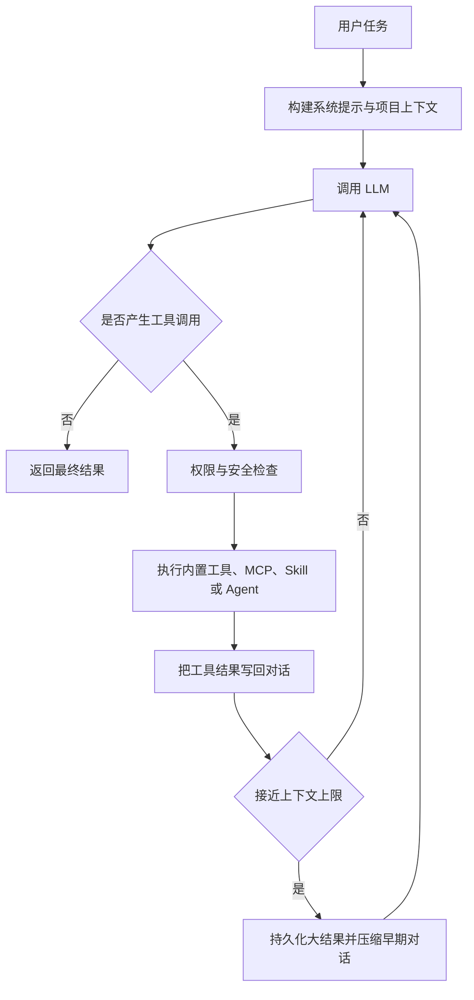

# CodePaceX Agent

CodePaceX Agent 是一个使用 Python 构建的终端 AI 编程助手。它通过可控、渐进的执行节奏完成代码阅读、计划、修改和验证：理解任务后检索项目上下文，按需调用工具，在错误反馈中继续迭代，并在长会话中压缩上下文和恢复关键工作状态。

名称中的 **Pace** 表示稳定推进、持续验证和迭代修复；**X** 表示 extensible，强调模型协议、工具、Skill、记忆与多 Agent 协作的扩展能力。

> CodePaceX is a terminal coding agent built around iterative tool use, plan-first workflows, extensible model protocols, durable sessions, and multi-agent collaboration.

## 功能概览

- ReAct 风格的模型—工具—结果循环，支持流式文本、thinking 和工具调用事件。
- Plan Mode：只允许读取项目和写入计划文件，完成后进入审批流程。
- Anthropic Messages、OpenAI Responses 和 OpenAI-compatible Chat Completions 三种协议。
- ReadFile、WriteFile、EditFile、Bash、Glob、Grep 等内置工具。
- MCP stdio 与 Streamable HTTP 连接，外部工具 Schema 按需暴露给模型。
- Markdown Skill、目录型 Skill、inline/fork 执行和自定义 Python 工具。
- JSONL 会话持久化、恢复、压缩边界和项目指令继承。
- 大型工具结果落盘与对话前缀摘要组成的两层上下文管理。
- 普通子 Agent、后台 Agent、Agent Team、Mailbox、共享任务和调用链追踪。
- Git worktree 隔离，以及进程内、tmux、iTerm2 teammate 后端。
- 危险命令检测、路径边界、分级规则、权限模式和人工确认。
- Textual TUI、非交互 CLI、NDJSON 事件流和远程浏览器界面。

## 执行流程



## 五层逻辑架构

| 层次 | 主要模块 | 职责 |
| --- | --- | --- |
| 交互层 | `app.py`、`remote.py`、`commands/` | TUI、远程界面、命令与用户审批 |
| Agent 引擎层 | `agent.py`、`client.py`、`conversation.py` | 模型调用、事件统一、工具循环与状态维护 |
| 工具扩展层 | `tools/`、`mcp/`、`skills/`、`hooks/` | 本地工具、外部协议、技能包与生命周期扩展 |
| 上下文与记忆层 | `context/`、`memory/`、`filehistory/` | Token 预算、会话恢复、项目指令与历史快照 |
| 安全与协作层 | `permissions/`、`agents/`、`teams/`、`worktree/` | 权限控制、任务委派、团队通信与文件隔离 |

这些层是职责上的逻辑分层，并非独立进程或强制的依赖隔离。

## 环境要求

- macOS 或 Linux
- Python 3.11 以上；开发环境固定使用 Python 3.12
- [uv](https://docs.astral.sh/uv/)
- 使用 worktree 或多 pane teammate 时需要 Git，以及可选的 tmux/iTerm2
- 至少一个可用的 Anthropic、OpenAI 或兼容服务 API

## 安装

macOS：

```bash
brew install uv
uv python install 3.12
uv sync --group dev
```

其他平台可先按 uv 官方文档安装 uv，再执行：

```bash
uv python install 3.12
uv sync --group dev
```

验证安装：

```bash
uv run python --version
uv run codepacex --help
```

## 配置

CodePaceX 按以下顺序加载并合并配置：

1. `~/.codepacex/config.yaml`
2. `<project>/.codepacex/config.yaml`
3. `<project>/.codepacex/config.local.yaml`

后加载的项目配置用于覆盖或补充用户配置。建议通过环境变量提供密钥，不要提交真实 API Key。

```yaml
providers:
  - name: anthropic-main
    protocol: anthropic
    base_url: https://api.anthropic.com
    model: claude-sonnet-4-6
    api_key: ${ANTHROPIC_API_KEY}
    thinking: true
    context_window: 200000
    max_output_tokens: 16000

  - name: openai-main
    protocol: openai
    base_url: https://api.openai.com/v1
    model: gpt-5
    api_key: ${OPENAI_API_KEY}

permission_mode: default
enable_fork: true
enable_verification_agent: true
teammate_mode: in-process
enable_coordinator_mode: false

worktree:
  symlink_directories:
    - node_modules
    - .venv
  stale_cleanup_interval: 3600
  stale_cutoff_hours: 24

mcp_servers:
  - name: local-tools
    command: uvx
    args: [example-mcp-server]
    env:
      EXAMPLE_TOKEN: ${EXAMPLE_TOKEN}

  - name: remote-tools
    url: https://example.com/mcp
    headers:
      Authorization: Bearer ${EXAMPLE_TOKEN}
```

协议取值：

- `anthropic`：Anthropic Messages API。
- `openai`：OpenAI Responses API。
- `openai-compat`：兼容 OpenAI Chat Completions 的服务。

## 运行方式

启动终端界面：

```bash
uv run codepacex
```

非交互执行：

```bash
uv run codepacex -p "分析这个项目的入口和核心调用链"
```

输出 NDJSON 事件：

```bash
uv run codepacex -p "运行测试并总结失败原因" --output-format stream-json
```

远程模式：

```bash
uv run codepacex --remote
```

服务默认监听 `0.0.0.0:18888`。该模式会暴露本地 Agent 能力，只应在可信网络中使用。

权限模式可以通过 `--mode` 临时覆盖配置：

```bash
uv run codepacex --mode plan
uv run codepacex --mode acceptEdits
```

## Plan Mode

Plan Mode 将 Agent 限制在读取、提问、委派探索和维护当前计划文件的范围内。计划保存在 `.codepacex/plans/`，调用 `ExitPlanMode` 后由交互层展示审批界面。Plan Mode 是应用级权限约束，不等同于操作系统沙箱。

## MCP 与延迟工具加载

CodePaceX 启动时连接 MCP Server 并获取工具列表，但未使用的 MCP 工具不会立即把完整 Schema 放入模型请求。Agent 先看到可用工具名称，再通过 `ToolSearch` 激活所需 Schema，以降低大量外部工具占用的上下文空间。

当前支持：

- 本地 stdio MCP Server
- Streamable HTTP MCP Server
- MCP Server instructions 注入
- 断线后的客户端重连
- Text、Image 和 Embedded Resource 结果摘要

## Skill

用户级 Skill 位于 `~/.codepacex/skills/`，项目级 Skill 位于 `.codepacex/skills/`。

```markdown
---
name: dependency-review
description: Review dependency changes and compatibility risks
allowedTools:
  - ReadFile
  - Grep
  - Bash
mode: inline
---

# Workflow

1. Read dependency manifests.
2. Inspect the lockfile diff.
3. Run relevant tests.
4. Summarize compatibility and security risks.

$ARGUMENTS
```

目录型 Skill 可以包含 `SKILL.md`、`tool.json` 和 `references/<tool>.py`。其中 Python 工具在当前进程内加载，因此只能使用可信 Skill。

## 自定义 Agent

用户级 Agent 位于 `~/.codepacex/agents/`，项目级 Agent 位于 `.codepacex/agents/`。

```markdown
---
name: api-reviewer
description: Review API design and backward compatibility
tools:
  - ReadFile
  - Grep
  - Glob
model: inherit
maxTurns: 30
permissionMode: default
background: false
isolation: worktree
---

Review public API changes, compatibility risks, and missing tests.
```

`isolation: worktree` 仅在 Git 仓库中可用。隔离 Agent 的改动会保留在独立 worktree 和分支中，不会自动合并到主工作区。

## 会话、上下文与记忆

- 会话以 JSONL 保存到 `.codepacex/sessions/`，支持恢复和不完整工具链截断。
- 超大工具结果保存到 `.codepacex/session/tool-results/`，模型只接收路径和预览。
- 接近模型窗口上限时，早期对话由 LLM 生成结构化摘要，近期消息保持原文。
- 压缩恢复附件保留最近读取文件和已启用 Skill 的有限快照。
- 用户级和项目级记忆分别位于 `~/.codepacex/memory/` 与 `.codepacex/memory/`。

上下文摘要是有损操作；完整会话记录用于在需要时回查原始细节。自动记忆提取当前尚未完成可靠的结构化落盘闭环，详见 `CODE_CHANGE_PROPOSALS.md`。

## 权限与安全边界

权限系统包含危险命令检测、文件路径边界、用户/项目/本地规则、会话级放行、权限模式和人工确认。

支持的模式：

| 模式 | 读取 | 写文件 | Shell |
| --- | --- | --- | --- |
| `default` | 自动允许 | 询问 | 询问 |
| `acceptEdits` | 自动允许 | 自动允许 | 询问 |
| `plan` | 只读及计划文件 | 受限 | 询问/拒绝 |
| `bypassPermissions` | 自动允许 | 自动允许 | 自动允许 |

安全边界：

- 这是应用级权限检查，不是容器、虚拟机或 OS sandbox。
- 获准执行的 Shell 命令继承 CodePaceX 进程的系统权限。
- MCP、Hook 和目录型 Skill 都可能运行外部代码或访问外部服务。
- `bypassPermissions` 只应在隔离、可信、可恢复的环境中使用。

## 项目结构

```text
codepacex/
├── agent.py           # Agent 主循环
├── client.py          # LLM 协议适配
├── app.py             # Textual TUI
├── tools/             # 内置工具与 ToolSearch
├── mcp/               # MCP 客户端和工具封装
├── skills/            # Skill 解析、加载和执行
├── memory/            # Session、Instructions、Memory Recall
├── context/           # 工具结果预算和 Auto-Compact
├── permissions/       # 权限模式、规则和路径边界
├── agents/            # 子 Agent 和后台任务
├── teams/             # Team、Mailbox 和共享任务
├── worktree/          # Git worktree 隔离
├── hooks/             # 生命周期 Hook
└── commands/          # 斜杠命令
tests/                 # 单元与集成测试
CODEPACEX.md           # 项目开发指令
CODE_CHANGE_PROPOSALS.md
```

## 测试

```bash
uv run pytest --collect-only -q
uv run pytest -q
uv run python -m compileall -q codepacex tests
```

当前本机环境：uv 0.11.23、CPython 3.12.13。

本次整理前后的测试结果一致：共运行 554 个测试，553 个通过，1 个失败。失败用例为 `tests/test_permissions.py::test_e2e_rule_allows_git`：测试在新建的非 Git 临时目录中执行 `git status`，实际命令按预期返回“not a git repository”，但测试错误地要求工具结果成功。该问题已记录，未在本轮修改业务代码或测试断言。

## 性能指标说明

- 延迟工具测试使用 50 个模拟重型 Schema，并验证初始 Schema 字符体积降低 90% 以上；它不是对真实百级 MCP 工具的 Token benchmark。
- 上下文压缩具备阈值、摘要、近期原文和恢复附件机制，但尚无数小时连续会话的标准化耐久测试。
- 多 Agent 支持并行与 worktree 隔离，但实际加速比取决于任务拆分、模型延迟、限流和合并成本。

在建立可复现 benchmark 前，不将合成数据解释为生产性能结论。

## 已知限制与 Roadmap

- 补全自动记忆提取的结构化输出和原子落盘闭环。
- 调整权限流水线为明确的 deny 优先语义。
- 收紧 Plan 文件的精确路径校验。
- 统一 TUI、Remote 和 `-p` 模式的运行时装配能力。
- 实现或移除尚未完成的 Agent Hook executor。
- 为 worktree 增加显式 diff、审批和集成流程。
- 建立 MCP Schema、长会话和多 Agent 的真实 benchmark。

详细修改建议见 [`CODE_CHANGE_PROPOSALS.md`](CODE_CHANGE_PROPOSALS.md)。
