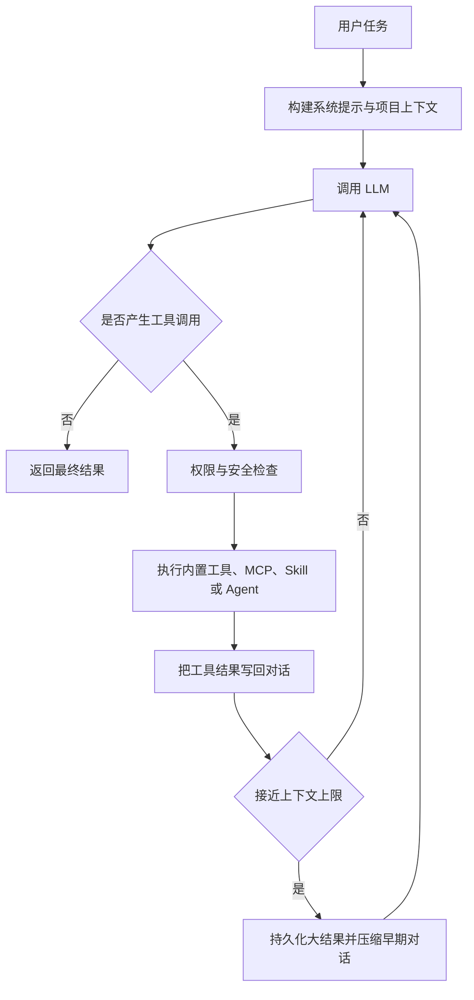

# CodePaceX Agent

CodePaceX Agent 是一个使用 Python 构建的终端 AI 编程助手。它通过可控、渐进的执行节奏完成代码阅读、计划、修改和验证：理解任务后检索项目上下文，按需调用工具，在错误反馈中继续迭代，并在长会话中压缩上下文和恢复关键工作状态。

名称中的 **Pace** 表示稳定推进、持续验证和迭代修复；**X** 表示 extensible，强调模型协议、工具、Skill、记忆与多 Agent 协作的扩展能力。

> CodePaceX is a terminal coding agent built around iterative tool use, plan-first workflows, extensible model protocols, durable sessions, and multi-agent collaboration.

## 功能概览

- ReAct 风格的模型—工具—结果循环，支持流式文本、thinking 和工具调用事件。
- Plan Mode：允许读取、提问、委派探索和维护计划文件，完成后进入审批流程。
- Anthropic Messages、OpenAI Responses 和 OpenAI-compatible Chat Completions 三种协议。
- ReadFile、WriteFile、EditFile、Bash、Glob、Grep 等内置工具。
- MCP stdio 与 Streamable HTTP 连接，外部工具 Schema 按需暴露给模型。
- Markdown Skill、目录型 Skill、inline/fork 执行和自定义 Python 工具。
- JSONL 会话持久化、恢复、压缩边界和项目指令继承。
- 大型工具结果落盘与对话前缀摘要组成的两层上下文管理。
- 普通子 Agent、后台 Agent、Agent Team、Mailbox、共享任务和调用链追踪。
- Git worktree 隔离，以及进程内、tmux、iTerm2 teammate 后端。
- 危险命令检测、路径边界、分级规则、权限模式和人工确认。
- Textual TUI、非交互 CLI、NDJSON 事件流和远程浏览器界面。

## 执行流程



## 五层逻辑架构

| 层次 | 主要模块 | 职责 |
| --- | --- | --- |
| 交互层 | `app.py`、`remote.py`、`commands/` | TUI、远程界面、命令与用户审批 |
| Agent 引擎层 | `agent.py`、`client.py`、`conversation.py` | 模型调用、事件统一、工具循环与状态维护 |
| 工具扩展层 | `tools/`、`mcp/`、`skills/`、`hooks/` | 本地工具、外部协议、技能包与生命周期扩展 |
| 上下文与记忆层 | `context/`、`memory/`、`filehistory/` | Token 预算、会话恢复、项目指令与历史快照 |
| 安全与协作层 | `permissions/`、`agents/`、`teams/`、`worktree/` | 权限控制、任务委派、团队通信与文件隔离 |

这些层是职责上的逻辑分层，并非独立进程或强制的依赖隔离。

## 项目结构

```text
codepacex/
  __main__.py          # CLI 入口与运行模式分发
  app.py               # Textual TUI 入口
  remote.py            # 远程浏览器模式
  agent.py             # Agent Loop、工具调度与事件流
  client.py            # Anthropic、OpenAI、OpenAI-compatible 客户端适配
  conversation.py      # 对话历史、工具调用和工具结果消息
  commands/            # TUI 斜杠命令与命令处理器
  tools/               # ReadFile、WriteFile、EditFile、Bash、Grep 等内置工具
  permissions/         # 权限模式、路径边界、危险命令检测和规则引擎
  context/             # 上下文预算、压缩和大结果落盘
  memory/              # 项目指令、长期记忆和会话记忆
  mcp/                 # MCP 客户端、连接管理和工具封装
  skills/              # Skill 加载、解析、执行和内置 Skill
  hooks/               # 生命周期 Hook 配置与执行
  agents/              # 子 Agent、后台任务、Agent 配置和调用追踪
  teams/               # Agent Team、Mailbox、共享任务和多后端 teammate
  worktree/            # Git worktree 隔离、清理和会话集成
  filehistory/         # 文件历史快照
```

## 非交互模式调用链

下面是 `uv run codepacex -p ...` 的主要文件级落点。TUI 和 remote 模式会在入口处分流到 `app.py` 或 `remote.py`，因此不完全复用这条初始化路径。

```text
pyproject.toml
-> codepacex.__main__:main
-> _run_prompt(...)
-> create_client(...)
-> create_default_registry(...)
-> PermissionChecker(...)
-> Agent(...)
-> ConversationManager(...)
-> Agent.run(...)
-> client.stream(...)
-> ToolRegistry.get(...)
-> PermissionChecker.check(...)
-> Tool.execute(...)
-> ConversationManager.add_tool_results_message(...)
```

一次典型 Agent Loop 可以理解为：

```text
用户：分析项目入口
Agent：ReadFile pyproject.toml
ToolResult：发现命令入口 codepacex.__main__:main
Agent：ReadFile codepacex/__main__.py
ToolResult：发现入口创建 client、registry、checker、agent、conversation
Agent：总结主调用链
```

## 环境要求

- macOS 或 Linux
- Python 3.11 以上；开发环境固定使用 Python 3.12
- [uv](https://docs.astral.sh/uv/)
- 使用 worktree 或多 pane teammate 时需要 Git，以及可选的 tmux/iTerm2
- 至少一个可用的 Anthropic、OpenAI 或兼容服务 API

## 安装

macOS：

```bash
brew install uv
uv python install 3.12
uv sync --group dev
```

其他平台可先按 uv 官方文档安装 uv，再执行：

```bash
uv python install 3.12
uv sync --group dev
```

验证安装：

```bash
uv run python --version
uv run codepacex --help
```

如果希望在任意代码仓库中直接使用当前源码版本，可以安装为用户级工具：

```bash
uv tool install --editable .
codepacex --help
```

editable 安装会跟随当前源码目录中的代码变化；依赖声明发生变化后，重新执行上述安装命令。

## 配置

CodePaceX 按以下顺序加载并合并配置：

1. `~/.codepacex/config.yaml`
2. `<project>/.codepacex/config.yaml`
3. `<project>/.codepacex/config.local.yaml`

后加载的项目配置用于覆盖或补充用户配置。建议通过环境变量提供密钥，不要提交真实 API Key。
首次使用时建议只保留一个 Provider；非交互模式默认使用列表中的第一个 Provider。

```yaml
providers:
  - name: anthropic
    protocol: anthropic
    base_url: https://api.anthropic.com
    api_key_env: ANTHROPIC_API_KEY
    default_model: claude-sonnet-4-6
    models:
      - claude-sonnet-4-6
      - claude-haiku-4-5
    thinking: true
    context_window: 200000
    max_output_tokens: 16000

  - name: openai
    protocol: openai
    base_url: https://api.openai.com/v1
    api_key_env: OPENAI_API_KEY
    default_model: gpt-5.5
    models:
      - gpt-5.5
      - gpt-5.4-mini

  - name: aliyun
    protocol: openai-compat
    base_url: https://dashscope.aliyuncs.com/compatible-mode/v1
    api_key_env: DASHSCOPE_API_KEY
    default_model: qwen-plus
    models:
      - qwen-plus
      - qwen-turbo
      - qwen-max

  - name: deepseek
    protocol: openai-compat
    base_url: https://api.deepseek.com/v1
    api_key_env: DEEPSEEK_API_KEY
    default_model: deepseek-chat
    models:
      - deepseek-chat
      - deepseek-reasoner

  - name: openrouter
    protocol: openai-compat
    base_url: https://openrouter.ai/api/v1
    api_key_env: OPENROUTER_API_KEY
    default_model: openai/gpt-4o-mini
    models:
      - openai/gpt-4o-mini
      - anthropic/claude-sonnet-4
      - deepseek/deepseek-chat

  - name: moonshot
    protocol: openai-compat
    base_url: https://api.moonshot.ai/v1
    api_key_env: MOONSHOT_API_KEY
    default_model: kimi-k2.6
    models:
      - kimi-k2.6

  - name: zhipu
    protocol: openai-compat
    base_url: https://open.bigmodel.cn/api/paas/v4/
    api_key_env: ZAI_API_KEY
    default_model: glm-5.2
    models:
      - glm-5.2

  - name: xiaomi-mimo
    protocol: openai-compat
    base_url: https://api.xiaomimimo.com/v1
    api_key_env: MIMO_API_KEY
    default_model: mimo-v2.5-pro
    models:
      - mimo-v2.5-pro
      - mimo-v2.5-pro-ultraspeed
      - mimo-v2.5

  - name: ollama-local
    protocol: openai-compat
    base_url: http://localhost:11434/v1
    api_key: ollama
    default_model: qwen3:8b
    models:
      - qwen3:8b
      - llama3.1:8b
      - gemma3:4b

  - name: lmstudio-local
    protocol: openai-compat
    base_url: http://localhost:1234/v1
    api_key: lm-studio
    default_model: local-model
    models:
      - local-model

  - name: vllm-local
    protocol: openai-compat
    base_url: http://localhost:8000/v1
    api_key: token-abc123
    default_model: local-vllm-model
    models:
      - local-vllm-model

fallback:
  - aliyun/qwen-max
  - aliyun/qwen-plus
  - deepseek/deepseek-chat
  - openrouter/openai/gpt-4o-mini

permission_mode: default
enable_fork: true
enable_verification_agent: true
teammate_mode: in-process
enable_coordinator_mode: false

worktree:
  symlink_directories:
    - node_modules
    - .venv
  stale_cleanup_interval: 3600
  stale_cutoff_hours: 24

mcp_servers:
  - name: local-tools
    command: uvx
    args: [example-mcp-server]
    env:
      EXAMPLE_TOKEN: ${EXAMPLE_TOKEN}

  - name: remote-tools
    url: https://example.com/mcp
    headers:
      Authorization: Bearer ${EXAMPLE_TOKEN}
```

Provider 的 API key 解析优先级为：`api_key` 明文值、`api_key_env` 指定的
环境变量、协议默认环境变量。协议默认环境变量为 `ANTHROPIC_API_KEY` 或
`OPENAI_API_KEY`；OpenAI-compatible provider 建议显式设置 `api_key_env`，例如
`DASHSCOPE_API_KEY`、`DEEPSEEK_API_KEY` 或 `OPENROUTER_API_KEY`。当前版本不会展开
`api_key` 字段中的 `${...}` 占位符，因此不要把环境变量占位符直接写在该字段中。
MCP 的 `env` 和 `headers` 配置仍支持 `${...}` 环境变量展开。

旧的 `model` 字段仍然可用；推荐的新写法是 `default_model` + `models`。
`models` 是候选模型列表，不保证账号一定有权限调用，实际可用模型以各平台控制台
或模型列表 API 为准。本地 provider 需要先启动 Ollama、LM Studio 或 vLLM 等服务；
本地 OpenAI-compatible 服务通常不校验 key，但 OpenAI SDK 仍要求 key 非空，因此可
使用 `api_key: ollama`、`api_key: lm-studio` 这类占位值。

`fallback` 是全局备用模型链，条目格式为 `provider/model`，按第一个 `/` 分割，
因此兼容 `openrouter/openai/gpt-4o-mini` 这类模型名。建议优先配置与主模型相同
protocol 的备用模型：

```yaml
fallback:
  - aliyun/qwen-plus
  - aliyun/qwen-turbo
  - deepseek/deepseek-chat
```

fallback 只是一轮请求内的临时恢复机制，不等同于 `/model use`。fallback 成功后
不会修改当前 active provider/model，不会更新 title/status 中显示的 active model，
也不会自动修改配置文件。下一轮请求仍会先使用当前 active model，再按 fallback 链
处理可恢复错误。

fallback 只会在尚未产生可见 streaming 输出前尝试备用模型；如果模型已经输出了部分
内容，本轮不会继续切换，以避免同一条 assistant 回复混用多个模型。切到备用模型前，
CodePaceX 会按备用模型的 protocol 和 context_window 重新 compact / rebuild prompt，
不会复用主模型 runtime 下预先构造的 prompt。为了避免不同协议的
thinking/reasoning/tool 历史不兼容，已有 conversation history 时默认跳过危险的
cross-protocol fallback。

会触发 fallback 的错误包括 rate limit、网络错误、timeout、服务端错误和 overloaded。
不会触发 fallback 的错误包括 missing key、认证失败、权限不足、模型不存在、配置错误、
无效 provider/model、用户取消和工具执行错误。fallback 不提供健康缓存、自动模型发现、
测速排行或 ModelRouter。

协议取值：

- `anthropic`：Anthropic Messages API。
- `openai`：OpenAI Responses API。
- `openai-compat`：兼容 OpenAI Chat Completions 的服务。

## 运行方式

启动终端界面：

```bash
uv run codepacex
```

非交互执行：

```bash
uv run codepacex -p "分析这个项目的入口和核心调用链"
```

这个最小 Demo 会让 Agent 先读取项目配置和入口文件，定位 `pyproject.toml` 中的脚本入口，再沿着 `__main__.py` 追踪 client、registry、checker、agent 和 conversation 的创建过程，最后总结核心调用链。

输出 NDJSON 事件：

```bash
uv run codepacex -p "运行测试并总结失败原因" --output-format stream-json
```

远程模式：

```bash
uv run codepacex --remote
```

服务默认监听 `0.0.0.0:18888`。该模式会暴露本地 Agent 能力，只应在可信网络中使用。

权限模式可以通过 `--mode` 临时覆盖配置：

```bash
uv run codepacex --mode plan
uv run codepacex --mode acceptEdits
```

## 常用斜杠命令

TUI 会话中可以使用 `/model` 管理当前会话的模型选择：

- `/model` 或 `/model current`：显示当前 provider、protocol、model 和 base URL。
- `/model list`：列出配置中的 provider 和候选模型，并标记当前 active 模型。
- `/model test` 或 `/model test <provider>/<model>`：对当前或指定 provider/model 发起一次最小连通性测试。
- `/model use <provider>/<model>`：切换当前会话后续请求使用的 provider/model。

`/model current` 会显示 fallback 链摘要；`/model list` 会标注 fallback 链中的模型。
这些展示不会联网探测健康状态，也不会显示 API Key。fallback 链只在请求失败时按配置
临时尝试备用模型，不提供自动测速、在线模型发现或 ModelRouter。

## Plan Mode

Plan Mode 将 Agent 限制在读取、提问、委派探索和维护当前计划文件的范围内。它允许只读工具、`Agent`、`ToolSearch`、`AskUserQuestion`、`ExitPlanMode`，并允许 `WriteFile` 或 `EditFile` 写入 `.codepacex/plans/` 下的计划文件。调用 `ExitPlanMode` 后由交互层展示审批界面。Plan Mode 是应用级权限约束，不等同于操作系统沙箱。

## MCP 与延迟工具加载

CodePaceX 启动时连接 MCP Server 并获取工具列表，但未使用的 MCP 工具不会立即把完整 Schema 放入模型请求。Agent 先看到可用工具名称，再通过 `ToolSearch` 激活所需 Schema，以降低大量外部工具占用的上下文空间。

当前支持：

- 本地 stdio MCP Server
- Streamable HTTP MCP Server
- MCP Server instructions 注入
- 断线后的客户端重连
- Text、Image 和 Embedded Resource 结果摘要

## Skill

用户级 Skill 位于 `~/.codepacex/skills/`，项目级 Skill 位于 `.codepacex/skills/`。

```markdown
---
name: dependency-review
description: Review dependency changes and compatibility risks
allowedTools:
  - ReadFile
  - Grep
  - Bash
mode: inline
---

# Workflow

1. Read dependency manifests.
2. Inspect the lockfile diff.
3. Run relevant tests.
4. Summarize compatibility and security risks.

$ARGUMENTS
```

目录型 Skill 可以包含 `SKILL.md`、`tool.json` 和 `references/<tool>.py`。其中 Python 工具在当前进程内加载，因此只能使用可信 Skill。

## 自定义 Agent

用户级 Agent 位于 `~/.codepacex/agents/`，项目级 Agent 位于 `.codepacex/agents/`。

```markdown
---
name: api-reviewer
description: Review API design and backward compatibility
tools:
  - ReadFile
  - Grep
  - Glob
model: inherit
maxTurns: 30
permissionMode: default
background: false
isolation: worktree
---

Review public API changes, compatibility risks, and missing tests.
```

`isolation: worktree` 仅在 Git 仓库中可用。隔离 Agent 的改动会保留在独立 worktree 和分支中，不会自动合并到主工作区。

## 会话、上下文与记忆

- 会话以 JSONL 保存到 `.codepacex/sessions/`，支持恢复和不完整工具链截断。
- 超大工具结果保存到 `.codepacex/session/tool-results/`，模型只接收路径和预览。
- 接近模型窗口上限时，早期对话由 LLM 生成结构化摘要，近期消息保持原文。
- 压缩恢复附件保留最近读取文件和已启用 Skill 的有限快照。
- 用户级和项目级记忆分别位于 `~/.codepacex/memory/` 与 `.codepacex/memory/`。

上下文摘要是有损操作；完整会话记录用于在需要时回查原始细节。自动记忆提取当前尚未完成可靠的结构化落盘闭环，详见 `CODE_CHANGE_PROPOSALS.md`。

## 权限与安全边界

权限检查由危险命令检测、路径边界、权限规则、会话级放行和权限模式共同决定。

| 模式 | read | write | command |
| --- | --- | --- | --- |
| `default` | allow | ask | ask |
| `acceptEdits` | allow | allow | ask |
| `plan` | allow | ask | ask |
| `bypassPermissions` | allow | allow | allow |

`plan` 模式会额外放行计划文件写入和少数计划工具。安全只读命令可自动放行；危险 Bash 命中黑名单会直接拒绝；文件路径超出项目根或系统临时目录时，在非 `bypassPermissions` 模式下会触发人工确认。用户级、项目级、本地权限规则以及本会话的 allow-always 记录可以进一步覆盖模式兜底结果。

安全边界：

- 这是应用级权限检查，不是容器、虚拟机或 OS sandbox。
- 获准执行的 Shell 命令继承 CodePaceX 进程的系统权限。
- MCP、Hook 和目录型 Skill 都可能运行外部代码或访问外部服务。
- `bypassPermissions` 只应在隔离、可信、可恢复的环境中使用。

## 测试

```bash
uv run pytest --collect-only -q
uv run pytest -q
uv run python -m compileall -q codepacex tests
```

当前本机环境：uv 0.11.23、CPython 3.12.13。2026-06-21 在已经初始化为
Git 仓库的项目目录中执行全量测试，共收集并运行 560 个测试，560 个全部通过，
耗时 5.68 秒。

## 性能指标说明

- 延迟工具测试使用 50 个模拟重型 Schema，并验证初始 Schema 字符体积降低 90% 以上；它不是对真实百级 MCP 工具的 Token benchmark。
- 上下文压缩具备阈值、摘要、近期原文和恢复附件机制，但尚无数小时连续会话的标准化耐久测试。
- 多 Agent 支持并行与 worktree 隔离，但实际加速比取决于任务拆分、模型延迟、限流和合并成本。

在建立可复现 benchmark 前，不将合成数据解释为生产性能结论。

## 已知限制与 Roadmap

已知限制：

- 当前项目主要用于学习和实验 AI Coding Agent 架构，不宣称替代生产级 Claude Code 或 Codex。
- 多 Agent、Agent Team 和 remote UI 能力还需要更多真实大型仓库任务验证。
- MCP 工具数量很大时，延迟加载策略仍需要更多压测。
- 权限系统是应用级安全边界，不等同于操作系统级沙箱。
- 复杂代码修改任务仍建议人工 review 后再提交。

Roadmap：

- 补全自动记忆提取的结构化输出和原子落盘闭环。
- 调整权限流水线为明确的 deny 优先语义。
- 收紧 Plan 文件的精确路径校验。
- 统一 TUI、Remote 和 `-p` 模式的运行时装配能力。
- 实现或移除尚未完成的 Agent Hook executor。
- 为 worktree 增加显式 diff、审批和集成流程。
- 建立 MCP Schema、长会话和多 Agent 的真实 benchmark。

详细修改建议见 [`CODE_CHANGE_PROPOSALS.md`](CODE_CHANGE_PROPOSALS.md)。
